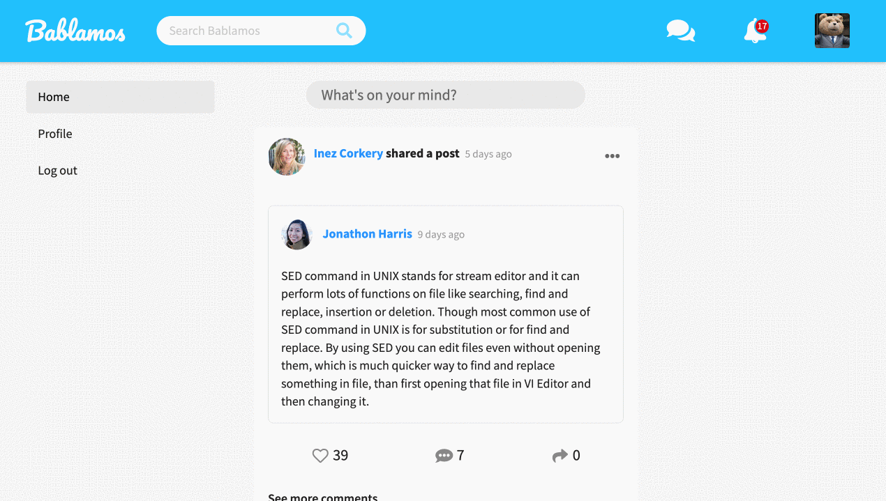
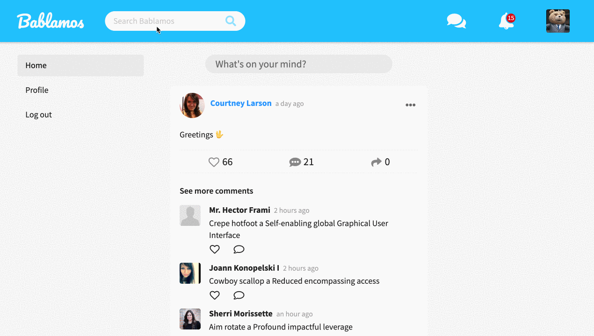
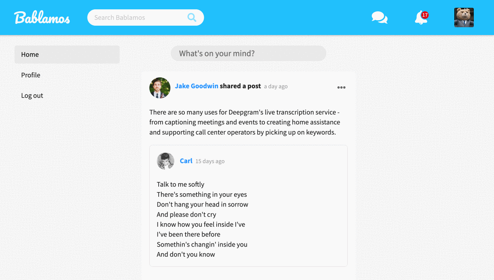
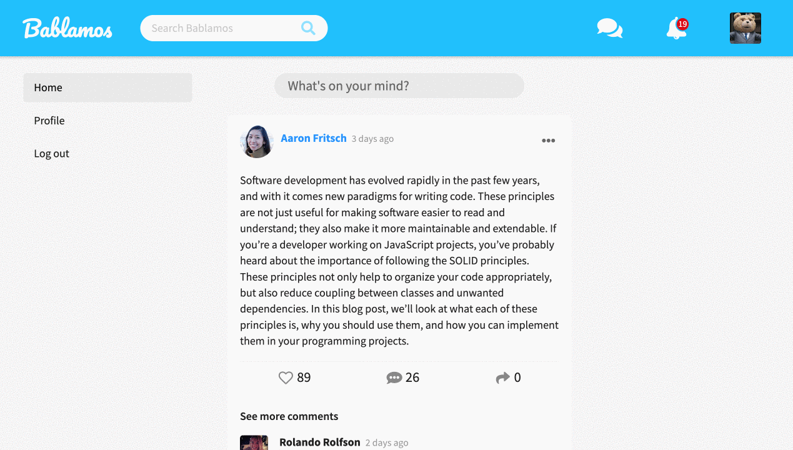
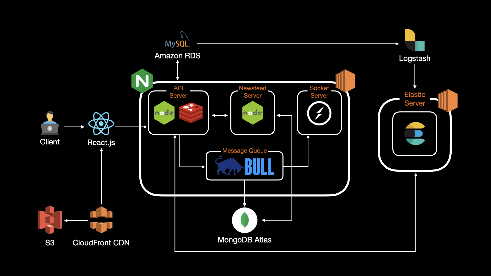
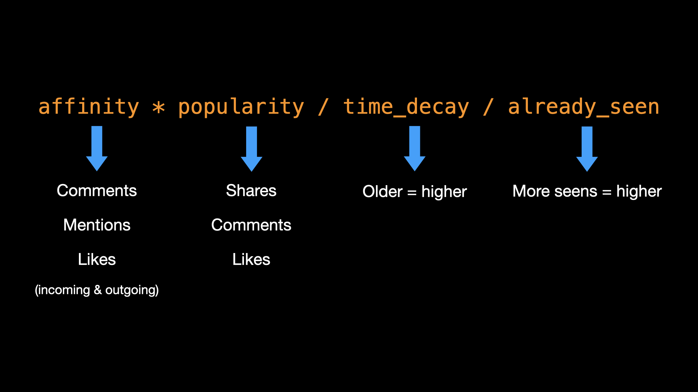
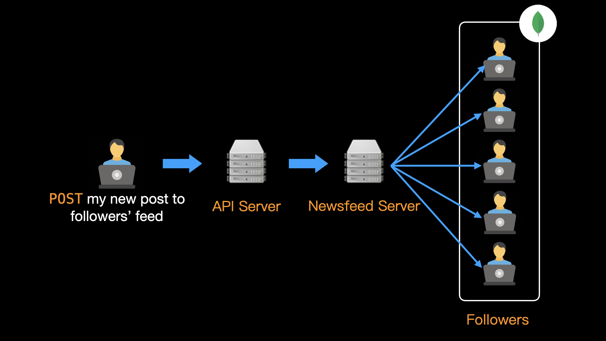
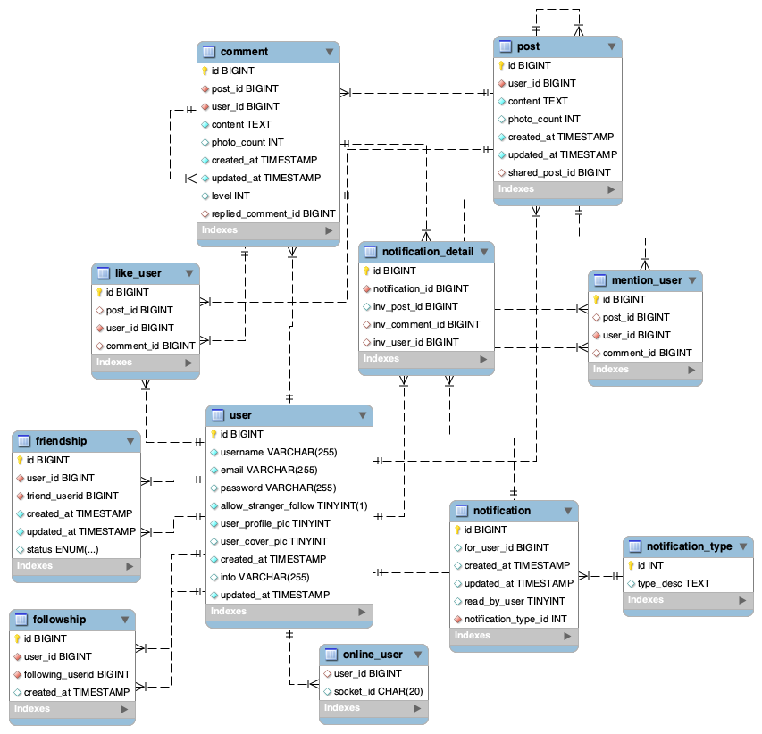

# bablamos.com

[bablamos.com](https://bablamos.com) is a social networking platform that prioritizes what you want to see.

## Table of Contents

-   [Demo Account](#Demo-Account)
-   [Features](#Features)
-   [Technologies](#Technologies)
-   [Architecture](#Architecture)
-   [Newsfeed Generation](#Newsfeed-Generation)
-   [Database Schema](#Database-Schema)

## Demo Account

-   Email: `test1@test.com`
-   Password: `password`

## Features

-   **[Newsfeed ranking](#Newsfeed-Generation)**: see the most relevant posts first
    

-   **Site-wide search**: search for users and posts without worrying about typos
    

-   **Create** or **share** posts, **like**, **comment**, and **tag** your friends:
    

-   Receive **real-time notifications** from your friends' activities:
    

## Technologies

-   **Back-End**:
    -   Runtime: Node.js
    -   Framework: Express.js
    -   Networking: Nginx
    -   OS: Linux
-   **Front-End**: React.js
-   **Database**:
    -   MySQL
    -   MongoDB
    -   Cache: Redis
    -   Search engine: Elasticsearch
-   **Cloud Services**:
    -   AWS: EC2, RDS, S3, CloudFront
    -   MongoDB Atlas
-   **Data pipeline**: Logstash
-   **Third-Party Libraries**: Socket.IO, bull

## Architecture



## Newsfeed Generation

### Algorithm



The order of the posts displayed in a user's newsfeed is determined by the **ranking algorithm** outlined above.

**Affinity**

A post is ranked higher if there are more interactions between the user and the author, all else being equal. Such interactions include (each with different weight):

-   **liking** each other's posts and comments
-   **commenting** on each other's posts
-   **mentioning** (_tagging_) each other in comments

Incoming and outgoing interactions, for instance _liking_ and _receiving_ likes, also have different weights in determining ranking score. These weights can be adjusted in `.env`.

<hr>

**Popularity**

Posts are more likely to be seen if they have more **likes**, **comments**, or **shares**, all else being equal. Shares are the highest-weighted and likes are the lowest. These weights are configurable in `.env`.

<hr>

**Time Decay**

Newer posts are generally displayed before older posts. The time decay factors are configurable in `.env` and detailed calculation can be seen in the `calculateTimeDecayFactor` function in [index.js](./newsfeed-generation-service/models/index.js).

<hr>

**Already-Seens**

Users generally would not want to see the same posts over and over again. Through JavaScript's **Intersection Observer API**, the server receives an array of seen posts on component unmount and divide these posts' ranking score by a given factor, configurable in `.env`.

### Push Model of Newsfeed Generation



When a user creates a new post, the server goes through these steps to ensure that the post is seen in the order appropriate to the viewer:

1. API server saves the post to **MySQL** and passes the `post_id` and `user_id` of author to Newsfeed Server.
2. Newsfeed server gets author-follower affinity data from **MongoDB** to determine **affinity** factor.
3. A **popularity buff** is generated for fresh posts without likes/comments/shares to determine **popularity** factor.
4. Newsfeed Server sends `updateMany` request to MongoDB and insert new post into followers' newsfeed array.

### Update Workers and Message Queues

**Affinity**, **popularity** and **time decay** factors of a post change dynamically. To make sure that a post's ranking score properly reflects its current status, the server will emit a re-calculation job to **bull** message queues when users perform certain actions or at regular intervals.

## Database Schema

### MySQL



### MongoDB

**User**

```
{
    user_id: Number,
    newsfeed: [
        {
            post_id: Number,
            user_id: Number,
            affinity: Number,
            like_score: Number,
            comment_score: Number,
            share_score: Number,
            fresh_pop_buff: Number,
            popularity: Number,
            time_decay_factor: Number,
            created_at: Number,
            views: Number,
            edge_rank_score: Number,
            is_new: Boolean,
        },
    ],
    affinity: [
        {
            user_id: Number,
            affinity: Number,
        },
    ],
    affinity_with_self: [
        {
            user_id: Number,
            affinity_with_self: Number,
        },
    ],
}
```
